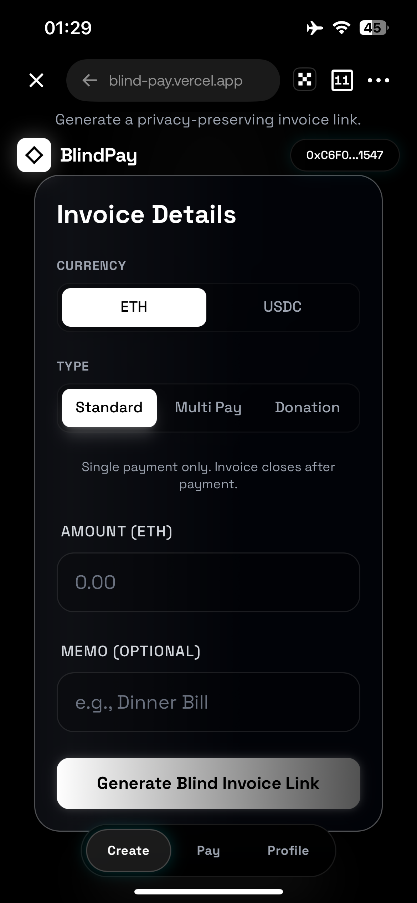
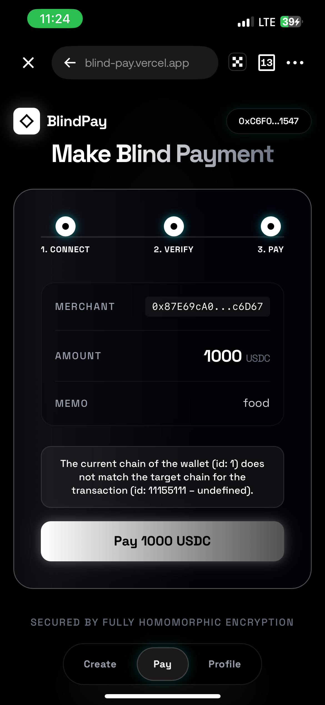
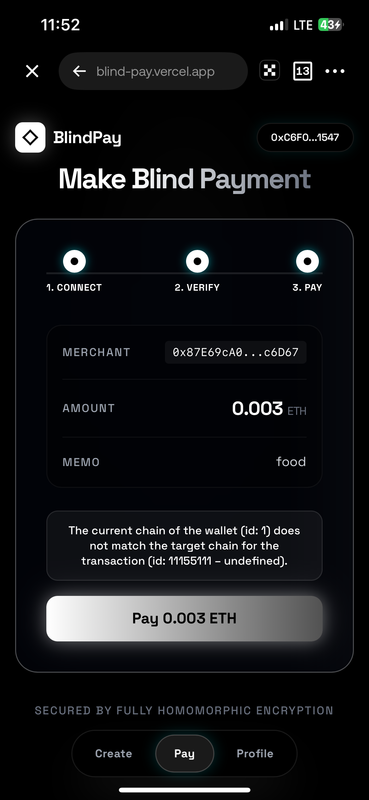
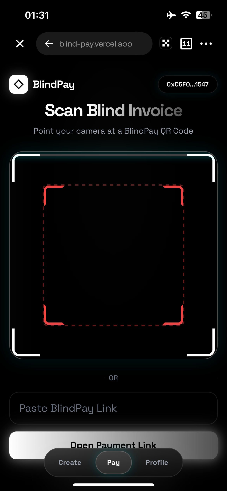

# BlindPay

**Privacy-first invoice and payment protocol on Starknet STRK20**

BlindPay lets merchants create invoices and receive payments through the [STRK20 privacy pool](https://strk20.starknet.io/docs). Payers deposit into a privacy escrow via shielded notes; merchants claim with a shared secret. Sender, recipient, and in-pool amounts stay hidden — settlement is verifiable without linking identities on-chain.

| Create Invoice | Private Pay | Merchant Claim | Scan QR |
|:-:|:-:|:-:|:-:|
|  |  |  |  |

**Chain:** Starknet (Sepolia / Mainnet)  
**Privacy:** STRK20 shielded notes + escrow helper  
**Wallet:** Privacy-enabled wallet ([Ready](https://www.argent.xyz/ready)) via [Privacy Wallet API](https://github.com/Akashneelesh/awesome-strk20)

---

## Features

### Core

- **Private invoice links** — QR codes and URLs with escrow commitment secrets
- **STRK20 escrow deposits** — Payers fund invoices through the privacy pool without revealing identity
- **Secret-based claims** — Merchants claim into shielded balances using `claimSecret`
- **Multi-token** — STRK and USDC on Starknet
- **Invoice types** — Standard, multi-pay, and donation
- **Merchant API** — Checkout sessions, webhooks, analytics (Stripe-like)
- **SDK / CLI / MCP** — Integrate BlindPay into your stack

### Developer experience

- **starknet.js v10** + `WalletAccountV6` for STRK20 actions
- **get-starknet v6** wallet discovery (Ready, Xverse)
- **Backend indexer** — Fast invoice lookups, encrypted merchant metadata
- **React frontend** — Desktop and mobile UI

---

## Architecture

```
Merchant                          Payer
   │                                │
   ├─ Generate salt + claimSecret   │
   ├─ commitment_hash (Poseidon)    │
   ├─ Save invoice (backend)      │
   ├─ Share payment link ─────────► │
   │                                ├─ STRK20: withdraw → escrow
   │                                ├─ privacy_invoke(deposit)
   │                                │
   ├─ STRK20: open note + claim ◄───│
   └─ Shielded balance              └─
```

### Layers

1. **STRK20 (on-chain)** — Privacy pool + [escrow helper](https://github.com/Akashneelesh/awesome-strk20/tree/main/pocs/escrow-helper) on Starknet
2. **Frontend** — React + starknet.js + Privacy Wallet API
3. **Backend** — Node.js indexer/API (PostgreSQL)

---

## Quick start

### Prerequisites

- Node.js 18+
- [Alchemy](https://alchemy.com) Starknet RPC key
- [Ready wallet](https://www.argent.xyz/ready) with STRK20 enabled (Sepolia or Mainnet)

### Install

```bash
npm install
cp frontend/.env.example frontend/.env
cp backend/.env.example backend/.env
```

### Configure frontend (`frontend/.env`)

```env
VITE_API_URL=http://localhost:3000/api
VITE_ALCHEMY_API_KEY=your-alchemy-key
VITE_STRK20_ESCROW_ADDRESS=0x01ad75c06ad9086bec4c24c967397c3fdbb32f8c11525bca82e425dc17d270cc
VITE_STRK20_POOL_ADDRESS=0xd894af9ed2bdede33675049ae5285df000c44258a2250b84a9c3bed0d7c233
```

### Run

```bash
# Terminal 1 — backend
cd backend && npm install && npm start

# Terminal 2 — frontend
cd frontend && npm install && npm run dev
```

Open http://localhost:5173

---

## STRK20 resources

- [awesome-strk20](https://github.com/Akashneelesh/awesome-strk20) — libraries, PoCs, escrow helper
- [strk20-starter-kit](https://github.com/Akashneelesh/strk20-starter-kit) — WalletAccountV6 integration reference
- [STRK20 by Example](https://strk20.starknet.io/docs) — integration guides
- [Private Escrow PoC](https://github.com/Akashneelesh/awesome-strk20/tree/main/pocs/private-escrow) — same pattern BlindPay uses

---

## Monorepo layout

```
BlindPay/
├── frontend/          # React app (STRK20 + Ready wallet)
├── backend/           # Indexer + merchant API
├── contracts/         # STRK20 integration notes (no Solidity)
└── packages/
    ├── sdk/           # @blindpay/node
    ├── cli/           # blindpay CLI
    └── mcp-server/    # MCP tools for agents
```

---

## License

MIT
